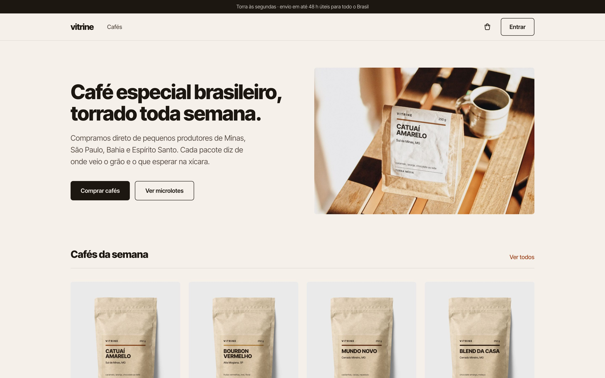
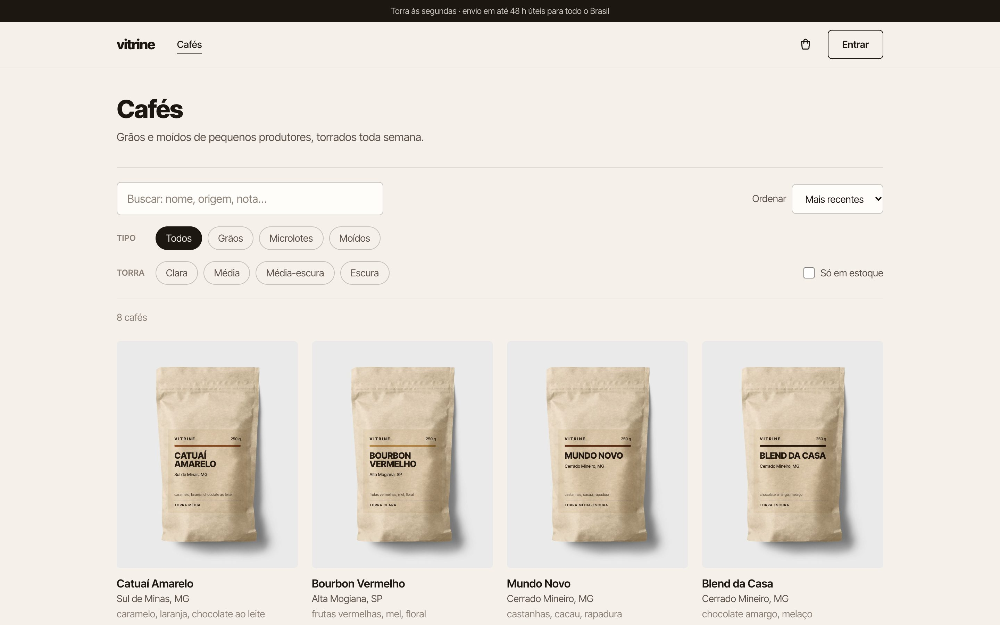
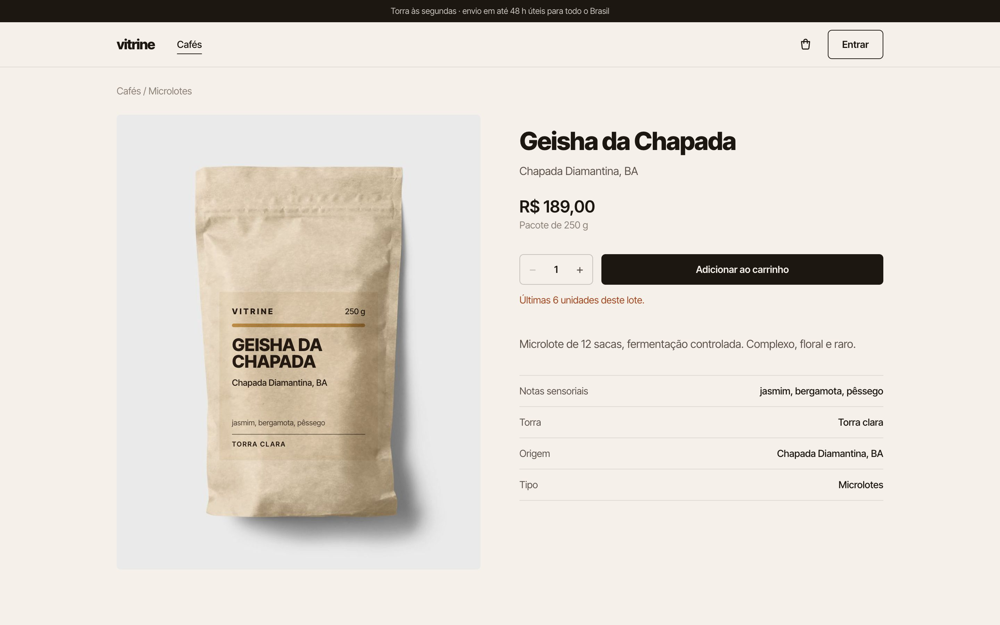
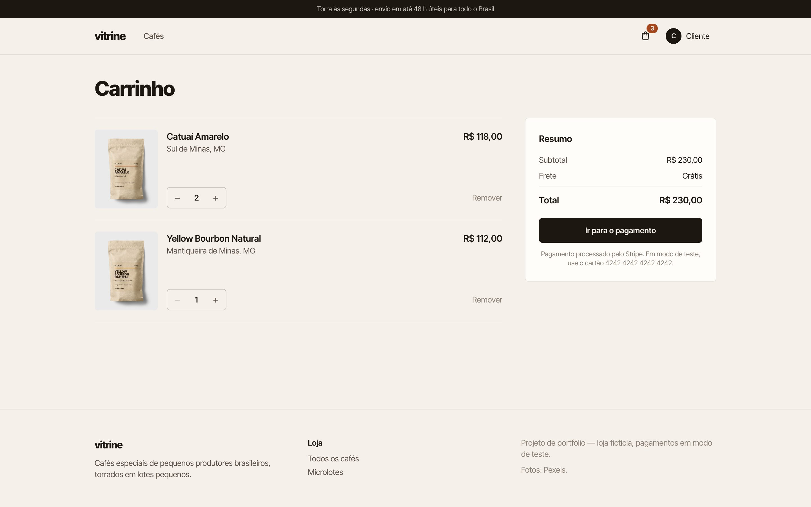
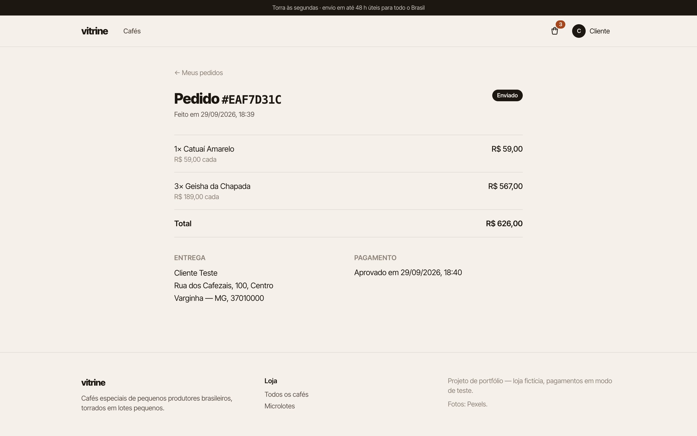
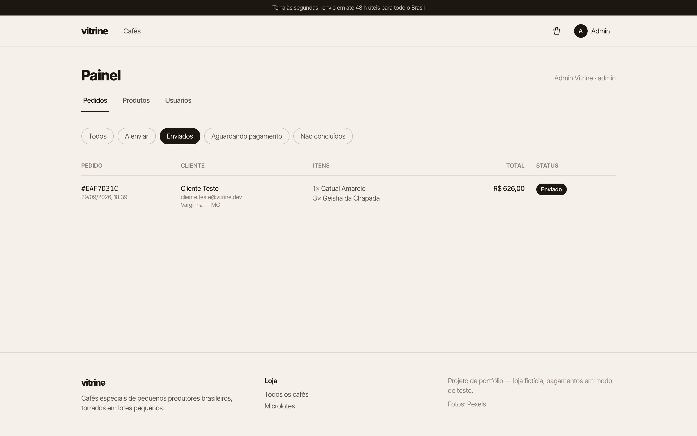
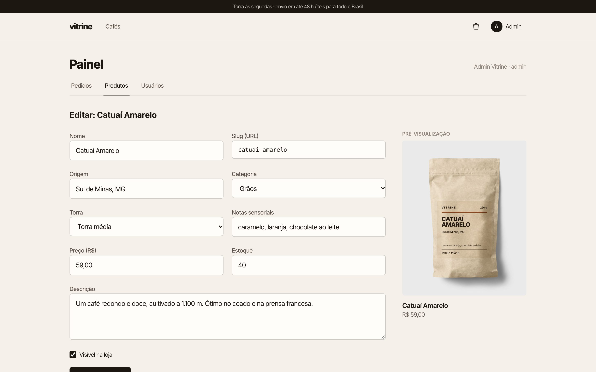
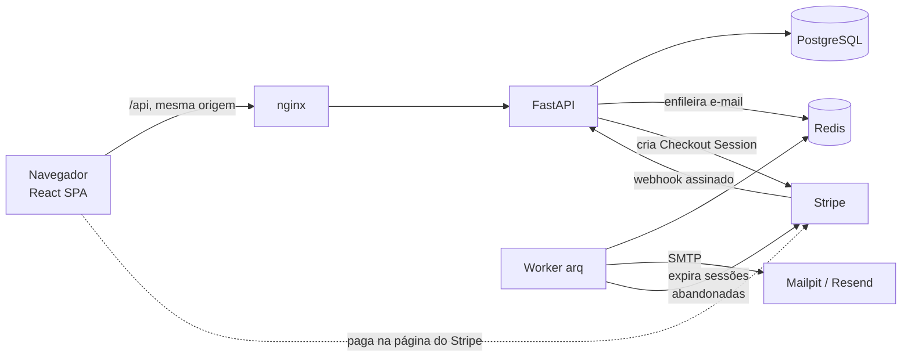
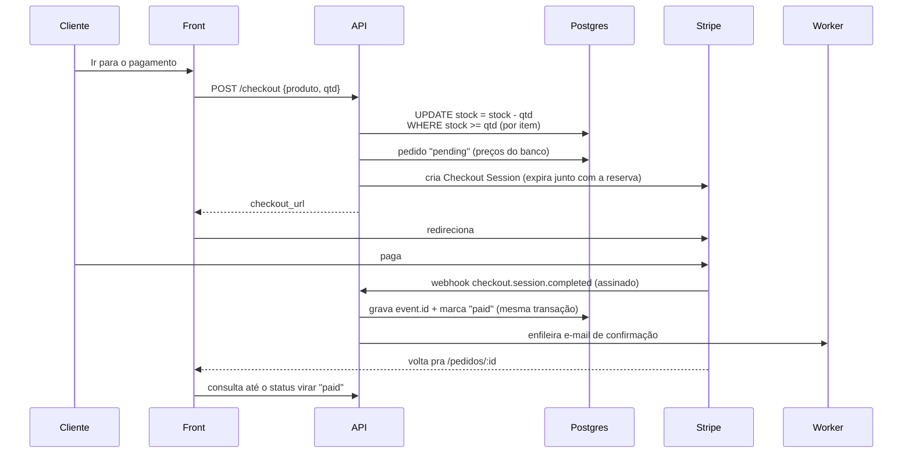

# Vitrine

[](https://github.com/guialmm/vitrine/actions/workflows/ci.yml)

E-commerce full-stack de uma torrefação fictícia de cafés especiais: catálogo,
carrinho, **pagamento com Stripe**, **autenticação com JWT e refresh token
rotativo**, **autorização por papéis** (cliente / equipe / admin) e **e-mails
transacionais** enviados por uma fila. FastAPI + PostgreSQL + Redis no backend,
React + TypeScript + Tailwind no frontend, tudo sobe com um `docker compose`.



## Contexto

Fazer uma tela de produto e um botão "comprar" é fácil. O que separa uma loja
de verdade de um tutorial são os casos que ninguém vê até darem errado:

- **Vender o que não tem.** Dois clientes clicam em "pagar" no último pacote ao
  mesmo tempo. Se o sistema só confere o estoque *antes* e desconta *depois*,
  os dois pagam — e um deles vai receber um reembolso e um pedido de desculpas.
- **Confirmar pagamento duas vezes (ou nunca).** O Stripe avisa que um pagamento
  foi aprovado via webhook, e entrega esse aviso *pelo menos uma vez*: pode
  chegar repetido, fora de ordem, ou atrasado depois que o cliente já voltou
  pra loja.
- **Confiar no navegador.** Preço vindo do front, papel de admin guardado no
  token por 15 minutos depois de ser revogado, token de acesso no
  `localStorage` ao alcance de qualquer script injetado.
- **Travar a requisição mandando e-mail.** Se o SMTP demora 5 s, o cadastro
  demora 5 s — ou falha junto.

O Vitrine é construído em volta desses problemas. Cada um tem um teste
automatizado que prova o comportamento (ver [Testes](#testes)).

## Funcionalidades

**Loja** — catálogo com busca por nome/origem/nota sensorial, filtros por tipo e
torra, ordenação e paginação (tudo na URL: dá pra compartilhar o link e o botão
voltar funciona); página do produto; carrinho persistente que revalida preço e
estoque ao abrir.

**Compra** — checkout hospedado pelo Stripe (o cartão nunca passa pela loja),
reserva de estoque na criação do pedido, cancelamento automático quando o
cliente desiste na página do Stripe, página do pedido que acompanha a
confirmação do pagamento, e-mail de confirmação.

**Conta** — cadastro, login, verificação de e-mail, "esqueci minha senha",
sessão que sobrevive a um F5 sem guardar token no `localStorage`.

**Painel** — pedidos por status e "marcar como enviado" (equipe), cadastro e
edição de produtos com prévia do rótulo (equipe), gestão de papéis de usuário
(só admin).

| | | |
|---|---|---|
|  |  |  |
|  |  |  |

## Arquitetura



- O **nginx** serve o React e faz proxy de `/api` pra API. Front e API ficam na
  mesma origem, então o cookie do refresh token funciona sem CORS nem
  `SameSite=None`.
- A **API** nunca manda e-mail: enfileira um job no Redis e responde. O
  **worker** (arq) renderiza o template, envia com retry e backoff exponencial,
  e a cada 5 min libera o estoque de pedidos abandonados (rede de segurança
  caso um webhook de expiração se perca).

### Fluxo de compra



## Decisões técnicas

**Estoque reservado com um `UPDATE` condicional.** Cada item do carrinho vira
`UPDATE products SET stock = stock - :q WHERE id = :id AND stock >= :q
RETURNING id`. É uma operação atômica: não existe janela entre "conferir" e
"descontar", então duas compras simultâneas do último pacote resultam em uma
aprovada e uma recusada (409). Os itens são travados sempre em ordem de id pra
evitar deadlock entre carrinhos que se sobrepõem, e um `CHECK (stock >= 0)` no
banco é a segunda rede de segurança. Tem teste disparando as duas compras em
paralelo.

**A reserva é commitada antes de chamar o Stripe.** Segurar o lock das linhas
de produto durante uma chamada de rede travaria o estoque de todo mundo. Se o
Stripe falhar, o pedido é expirado e o estoque devolvido (502 pro cliente).

**Webhook idempotente.** A assinatura é validada sobre o corpo *bruto* da
requisição. O `event.id` é inserido em `processed_stripe_events` com
`ON CONFLICT DO NOTHING` **na mesma transação** que aplica o efeito: se o
processamento falhar, o registro também é desfeito e o retry do Stripe tenta
de novo; se o evento chegar repetido, é ignorado. Também são tratados:
pagamento assíncrono (boleto chega como `completed` mas `unpaid`), valor pago
diferente do total do pedido, e pagamento que chega depois da reserva expirar
(tenta reservar de novo, tudo-ou-nada via savepoint).

**Preço vem sempre do banco.** O front manda só `{product_id, quantity}`. O
pedido guarda um *snapshot* de nome e preço de cada item, então editar o
produto depois não altera pedidos antigos.

**Refresh token rotativo com detecção de roubo.** O access token (JWT, 15 min)
fica **só na memória** do front. O refresh token é opaco, aleatório, guardado
como SHA-256 no banco, e vai num cookie `httpOnly` + `SameSite=Lax` restrito ao
path `/api/auth`. A cada uso ele é trocado por um novo da mesma "família"; se
um token já trocado aparecer de novo, alguém tem uma cópia — a família inteira
é revogada e todo mundo precisa logar de novo. Do lado do front, 401s
simultâneos compartilham **uma** renovação (single-flight): duas renovações
com o mesmo cookie seriam lidas como roubo.

**Papel relido do banco a cada requisição.** O JWT carrega o `sub`, mas o papel
vem do banco: rebaixar alguém tem efeito imediato, não 15 minutos depois. Um
admin não pode mudar o próprio papel (a loja nunca fica sem admin).

**Links de e-mail sem tabela extra.** Verificação e reset são JWTs com um
`type` próprio (um access token não serve como link de reset e vice-versa). O
de reset carrega uma impressão digital do hash da senha atual: trocou a senha,
o link morre — uso único sem guardar nada. Trocar a senha também revoga todas
as sessões abertas.

**Sem enumeração de contas.** Login com e-mail inexistente e com senha errada
dão a mesma resposta e levam o mesmo tempo (o hash é comparado com um hash
fictício); "esqueci minha senha" responde 202 sempre.

**Fotos reais com rótulo gerado.** As fotos são de pacotes kraft sem marca
(Pexels). O rótulo de cada café é HTML gerado a partir dos dados do produto e
projetado sobre a foto com uma **homografia** (`matrix3d` calculada a partir
dos 4 cantos da etiqueta medidos na imagem), com `mix-blend-mode: multiply`
pra textura e sombra do papel aparecerem através da "tinta". Qualquer produto
novo cadastrado no painel já ganha um pacote com o próprio rótulo.

## Stack

- **Backend:** Python 3.12, FastAPI, SQLAlchemy 2 (async) + asyncpg, Alembic,
  PostgreSQL 17, Redis + arq (fila), PyJWT, pwdlib (argon2id), Stripe SDK,
  Jinja2 + aiosmtplib
- **Frontend:** React 19, TypeScript, Vite, Tailwind CSS 4, React Router,
  TanStack Query
- **Infra:** Docker Compose, nginx, GitHub Actions, Mailpit (SMTP local)

## Rodando

### Stack inteira via Docker

```bash
cp .env.example .env    # opcional: coloque suas chaves de teste do Stripe
docker compose --profile app up --build
```

Na primeira subida o banco é populado sozinho (cafés, admin e conta demo).

- Loja: http://localhost:8080
- Caixa de e-mails (Mailpit): http://localhost:8025
- Admin de demonstração: `admin@vitrine.dev` / `vitrine-admin` (só em dev)
- Cliente demo (já verificado): `demo@example.com` / `vitrine-demo`

Pra testar o pagamento, use chaves **de teste** do Stripe no `.env` e
encaminhe os webhooks com o [Stripe CLI](https://docs.stripe.com/stripe-cli):

```bash
stripe listen --forward-to localhost:8080/api/webhooks/stripe
```

O `whsec_...` que ele imprime vai em `STRIPE_WEBHOOK_SECRET`. Cartão de teste:
`4242 4242 4242 4242`, qualquer validade futura e CVC.

### Desenvolvimento (com hot reload)

```bash
docker compose up -d db redis mailpit

cd backend
python -m venv .venv && .venv/bin/pip install -r requirements-dev.txt
.venv/bin/alembic upgrade head && .venv/bin/python -m app.seed
.venv/bin/uvicorn app.main:app --reload --port 8001   # API
.venv/bin/arq app.worker.WorkerSettings               # worker (outro terminal)

cd ../frontend
npm install && npm run dev                            # http://localhost:5174
```

O Vite faz proxy de `/api` pra `localhost:8001`; o webhook fica em
`localhost:8001/api/webhooks/stripe`.

## Deploy

Tudo em planos gratuitos:

| Peça | Serviço | Observação |
|---|---|---|
| API + worker | Render (Docker) | `render.yaml` (Blueprint); o worker roda dentro da API (`RUN_WORKER_INLINE`), já que *background worker* é pago |
| Postgres | Neon | a URL `postgresql://…?sslmode=require` é convertida sozinha pro formato do asyncpg |
| Redis | Upstash | `rediss://` (TLS) |
| Front | Vercel | `frontend/vercel.json` faz rewrite de `/api/*` pro Render: navegador vê uma origem só, o cookie do refresh continua first-party |
| E-mail | Brevo (SMTP) | sem domínio próprio, enviando de um remetente verificado |

Na subida o container roda as migrations e o seed **só se o banco estiver vazio**
(`python -m app.seed --if-empty`); em produção ele se recusa a criar o admin com a
senha padrão. A conta demo usa um endereço `example.com` e nunca recebe e-mail,
então nenhum visitante consegue disparar um reset que tire os outros da conta.

O plano grátis do Render hiberna após 15 min sem acesso: a primeira visita pode
levar ~30 s pra acordar a API. Webhooks do Stripe que chegarem nesse intervalo
são reenviados por ele automaticamente.

## Testes

```bash
cd backend && .venv/bin/pytest        # 61 testes, Postgres real (banco vitrine_test)
cd frontend && npm test               # 8 testes (Vitest)
```

Os testes do backend rodam contra um Postgres de verdade (não SQLite), porque
o que está sendo testado depende dele: locks, `RETURNING`, `ON CONFLICT`,
check constraints. O Stripe e o SMTP são substituídos por fakes na fronteira
(`PaymentGateway` e `Mailer` são `Protocol`s), e os webhooks de teste são
assinados com o mesmo HMAC que o Stripe usa.

Alguns dos cenários cobertos:

- duas compras simultâneas do último pacote → uma 201, uma 409, estoque 0
- carrinho com um item sem estoque → nenhum item é reservado
- falha do Stripe ao criar a sessão → estoque devolvido
- webhook reenviado → processado uma vez, um e-mail só
- webhook com assinatura adulterada → 400
- boleto (`completed` + `unpaid`) → só vira pago no `async_payment_succeeded`
- valor pago ≠ total do pedido → não marca como pago
- refresh token reutilizado → família revogada, inclusive o token legítimo
- link de reset usado duas vezes → segunda vez falha
- cliente não vê pedido de outro cliente (404, não 403)
- equipe não gerencia papéis; admin não rebaixa a si mesmo
- no front: 401s simultâneos disparam **uma** renovação de token

O CI roda tudo isso a cada push, mais `alembic upgrade head && downgrade base`
pra garantir que as migrations vão e voltam.

## Estrutura

```
backend/
  app/
    auth/        cadastro, login, refresh rotativo, verificação, reset
    catalog/     listagem pública, busca e filtros
    orders/      checkout, reserva de estoque, ciclo de vida do pedido
    payments/    gateway do Stripe e webhook
    admin/       painel: produtos, pedidos, papéis
    emails/      fila, templates (HTML + texto) e envio SMTP
    core/        config, banco, segurança, dependências (RBAC)
    worker.py    jobs do arq: e-mails e expiração de pedidos
  alembic/       migrations
  tests/
frontend/
  src/
    features/    auth (sessão, guarda de rota) e carrinho
    pages/       loja, conta, pedidos e painel (carregado sob demanda)
    components/  foto do produto com rótulo projetado, UI base
    lib/         cliente da API, homografia, formatação
```

## Créditos

Fotos dos pacotes: [Pexels](https://www.pexels.com) (licença Pexels, uso
livre). A Vitrine é uma loja fictícia; nenhum pagamento real é processado.

## Licença

[MIT](LICENSE)
